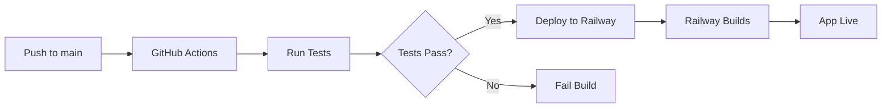

# GitHub CI/CD Setup for Railway Deployment

This guide explains how to set up automated deployment to Railway using GitHub Actions.

## 🎯 Overview

Two GitHub Actions workflows have been created:

1. **`railway-deploy.yml`** - Automated deployment to Railway
2. **`tests.yml`** - Code quality checks and validation

## 🔧 Setup Instructions

### Step 1: Get Railway Token

1. Go to [Railway Dashboard](https://railway.app/account/tokens)
2. Click **"Create Token"** or **"New Token"**
3. Give it a name (e.g., "GitHub Actions Deploy")
4. Copy the token (starts with `railway_`)

### Step 2: Get Railway Service ID

#### Option A: Using Railway CLI
```bash
# Install Railway CLI
npm i -g @railway/cli

# Login
railway login

# Link to your project
railway link

# Get service ID
railway status
```

#### Option B: From Railway Dashboard
1. Go to your Railway project
2. Click on your service
3. Go to **Settings**
4. Copy the **Service ID** from the URL or settings page

### Step 3: Add GitHub Secrets

1. Go to your GitHub repository
2. Navigate to **Settings** → **Secrets and variables** → **Actions**
3. Click **"New repository secret"**
4. Add the following secrets:

| Secret Name | Description | Example |
|------------|-------------|---------|
| `RAILWAY_TOKEN` | Your Railway API token | `railway_xxxxx...` |
| `RAILWAY_SERVICE_ID` | Your Railway service ID | `abc123-def456-...` |

**Important:** Never commit these values to your repository!

### Step 4: Configure Environment Variables in Railway

Ensure these are set in Railway dashboard:

```bash
OPENAI_API_KEY=your_key
ANTHROPIC_API_KEY=your_key
GOOGLE_API_KEY=your_key
PORT=7860
GRADIO_SERVER_NAME=0.0.0.0
```

## 📋 Workflow Details

### Railway Deploy Workflow (`railway-deploy.yml`)

**Triggers:**
- Push to `main` or `master` branch
- Pull requests to `main` or `master` (validation only)
- Manual trigger via GitHub UI

**Steps:**
1. ✅ Checkout code
2. ✅ Set up Python 3.11
3. ✅ Install dependencies
4. ✅ Run linting checks
5. ✅ Deploy to Railway (only on push to main/master)

**Features:**
- Automatic deployment on merge to main
- Dependency caching for faster builds
- Optional linting validation
- Only deploys on main branch pushes

### Tests Workflow (`tests.yml`)

**Triggers:**
- Push to `main`, `master`, or `develop` branches
- Pull requests to `main` or `master`

**Steps:**
1. ✅ Test on Python 3.10, 3.11, 3.12
2. ✅ Lint with flake8
3. ✅ Check code formatting (black)
4. ✅ Type checking (mypy)
5. ✅ Security scanning (bandit)
6. ✅ Validate imports
7. ✅ Compile Python files

**Features:**
- Multi-version Python testing
- Code quality checks
- Security vulnerability scanning
- Import validation

## 🚀 How It Works

### Automatic Deployment Flow



### Manual Deployment

1. Go to **Actions** tab in GitHub
2. Select **"Deploy to Railway"** workflow
3. Click **"Run workflow"**
4. Select branch and click **"Run workflow"**

## 🔍 Monitoring Deployments

### GitHub Actions
1. Go to **Actions** tab
2. Click on a workflow run
3. View logs and status

### Railway Dashboard
1. Go to your Railway project
2. Click **Deployments** tab
3. View deployment status and logs

## 🐛 Troubleshooting

### Deployment Fails

**Problem:** `RAILWAY_TOKEN` not found
**Solution:** 
- Verify secret is added in GitHub Settings → Secrets
- Check spelling: `RAILWAY_TOKEN` (case-sensitive)

**Problem:** `RAILWAY_SERVICE_ID` not found
**Solution:**
- Add the service ID as a GitHub secret
- Get it from Railway dashboard or CLI

**Problem:** Railway deployment fails
**Solution:**
- Check Railway logs for errors
- Verify environment variables are set in Railway
- Ensure Railway project is linked correctly

### Tests Fail

**Problem:** Import errors
**Solution:**
- Check `requirements.txt` is up to date
- Verify all dependencies are listed

**Problem:** Linting errors
**Solution:**
- Run `flake8 .` locally to see errors
- Fix code style issues
- Or set `continue-on-error: true` (already configured)

## 🔒 Security Best Practices

### GitHub Secrets
- ✅ Never commit secrets to repository
- ✅ Use GitHub Secrets for sensitive data
- ✅ Rotate tokens regularly
- ✅ Use minimal permissions

### Railway Tokens
- ✅ Create separate tokens for CI/CD
- ✅ Revoke unused tokens
- ✅ Monitor token usage in Railway dashboard

### Environment Variables
- ✅ Set in Railway dashboard, not in code
- ✅ Use `.env.example` as template
- ✅ Never commit `.env` file

## 📊 Workflow Status Badges

Add these to your README.md:

```markdown


```

Replace `YOUR_USERNAME` and `YOUR_REPO` with your GitHub username and repository name.

## 🎛️ Customization

### Change Deployment Branch

Edit `.github/workflows/railway-deploy.yml`:

```yaml
on:
  push:
    branches:
      - production  # Change to your branch
```

### Add More Tests

Edit `.github/workflows/tests.yml`:

```yaml
- name: Run unit tests
  run: |
    pip install pytest
    pytest tests/
```

### Deploy to Multiple Environments

Create separate workflows for staging and production:

- `.github/workflows/deploy-staging.yml`
- `.github/workflows/deploy-production.yml`

Use different `RAILWAY_SERVICE_ID` secrets for each environment.

## 🔄 Deployment Frequency

### Automatic Deployments
- Every push to `main` triggers deployment
- Typical deployment time: 2-5 minutes
- Railway handles zero-downtime deployments

### Manual Deployments
- Use workflow dispatch for manual control
- Useful for hotfixes or specific commits

## 📈 Monitoring & Alerts

### GitHub Actions Notifications
- Email notifications on workflow failures
- Configure in GitHub Settings → Notifications

### Railway Notifications
- Set up in Railway project settings
- Slack, Discord, or webhook integrations available

## 🆘 Getting Help

### Resources
- [GitHub Actions Documentation](https://docs.github.com/en/actions)
- [Railway Documentation](https://docs.railway.app/)
- [Railway CLI Guide](https://docs.railway.app/develop/cli)

### Common Commands

```bash
# Test workflow locally (requires act)
act -j deploy

# View Railway logs
railway logs

# Check Railway status
railway status

# Redeploy manually
railway up
```

## ✅ Verification Checklist

After setup, verify:

- [ ] GitHub secrets are added (`RAILWAY_TOKEN`, `RAILWAY_SERVICE_ID`)
- [ ] Railway environment variables are set
- [ ] Push to main triggers deployment
- [ ] Tests run on pull requests
- [ ] Deployment succeeds in Railway
- [ ] App is accessible at Railway URL
- [ ] All features work correctly

## 🎉 Success!

Your CI/CD pipeline is now configured! Every push to main will automatically:

1. ✅ Run code quality checks
2. ✅ Validate Python syntax
3. ✅ Deploy to Railway
4. ✅ Make your app live

---

**Last Updated:** October 2025
**GitHub Actions Version:** v4/v5
**Railway CLI Version:** Latest
